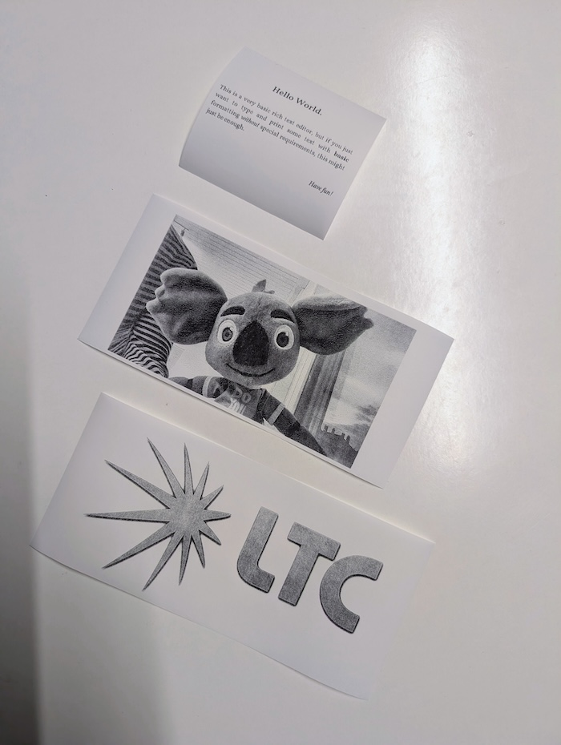
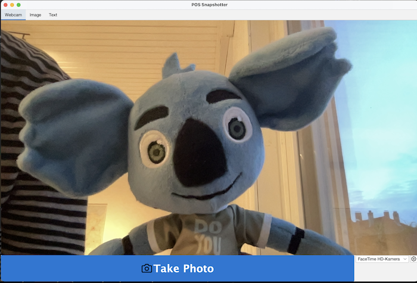
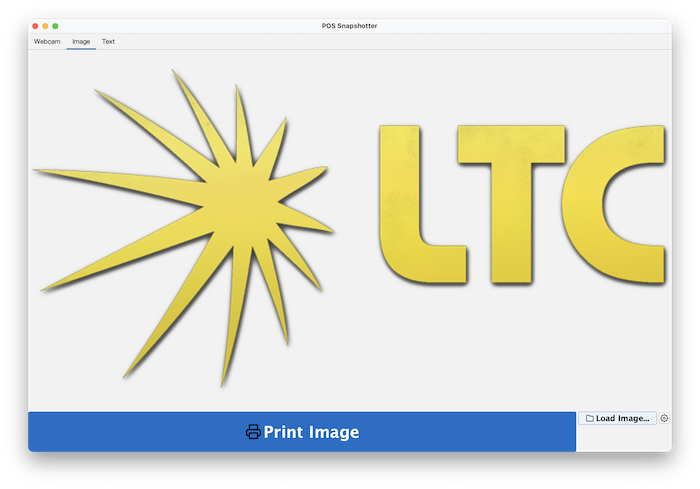
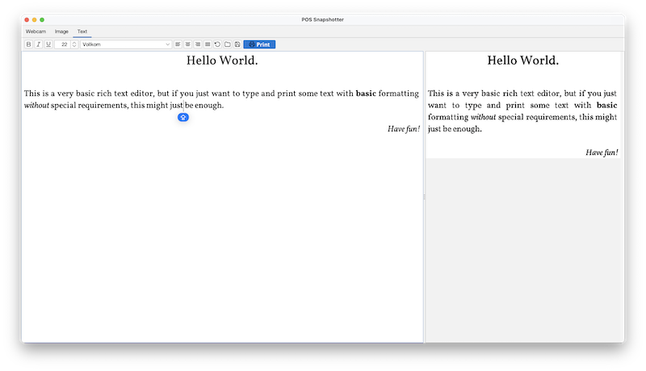

# PosSnapshotter

PosSnapshotter is a Java-based desktop application designed for capturing images (from a webcam or file) and printing them on ESC/POS thermal printers (specifically Epson multi-tone models). It features advanced dithering algorithms to produce high-quality grayscale-like output on 1-bit or multi-bit thermal heads.

[](docs/result.jpg)

[](docs/webcam.png)

[](docs/image.png)

[](docs/text.png)

## Features

- **Webcam Capture**: Real-time preview and capture from connected webcams using OpenCV/JavaCV.
- **Image File Printing**: Load local images, scale them appropriately, and apply dithering.
- **Text Editor**: Rich text editor for printing formatted text (bold, italic, alignment, font sizes).
- **Advanced Dithering**:
  - Support for multiple error diffusion matrices (Floyd-Steinberg, Jarvis-Judice-Ninke, Sierra Lite, and a custom "Flubba" matrix).
  - Adjustable parameters: Sharpness (Unsharp Mask), Contrast, Gamma Correction.
  - **CLAHE** (Contrast Limited Adaptive Histogram Equalization) for enhanced detail in various lighting conditions.
- **Multi-tone Printing**: Specifically tuned for Epson printers that support multiple thermal head levels (via `GS ( L` commands).
- **Modern UI**: Built with Swing and FlatLaf for a clean, cross-platform look.
- **REST API & Web Editor**: A built-in web server providing a rich text editor (ProseMirror) and remote printing capabilities.

## Requirements

- Java 25 or higher.
- A compatible ESC/POS thermal printer (Epson multi-tone support recommended for best results).
- A webcam (for the webcam capture feature).

## Installation & Running

This project uses Maven. To build and run:

```bash
mvn clean package
java -jar target/possnapshotter.jar [FLAGS]
```

### CLI Flags

The following flags are available to control the application behavior:

- `--server`: Enables the REST API and Web Editor on port `8080`. Disabled by default.
- `--headless`: Runs the application without the Swing GUI. Useful for server-only deployments. Disabled by default.

## Web Editor & API

When started with the `--server` flag, the application hosts a web interface at `http://localhost:8080`.

### Endpoints

- `GET /`: Serves the ProseMirror-based rich text editor.
- `GET /fonts`: Returns a JSON list of available system font families.
- `POST /preview`: Accepts HTML in the request body and returns a dithered PNG preview of the rendered content.
- `POST /print`: Accepts HTML in the request body, renders it, and sends it to the default printer.
- `/static/*`: Serves static assets for the web frontend.

## Configuration

The application automatically saves your preferences (dithering parameters, camera selection, etc.) using Java Preferences API.

## Technical Details

- **Dithering**: The core logic is implemented in `Dithering.java`, which handles the entire pipeline from grayscale conversion to error diffusion.
- **Printer Communication**: Uses the `escpos-coffee` library, extended with custom `DitherableEscPosImage` and `DitheredEpsonGrayscaleImageWrapper` to support multi-tone output.
- **Webcam**: Managed via `JavaCV` with a dedicated `CameraPanel` for high-performance rendering.

## Testing

Comprehensive unit tests are included, covering image processing kernels, matrix math, and pipeline logic.

```bash
mvn test
```

## License

This project is licensed under the MIT License.
